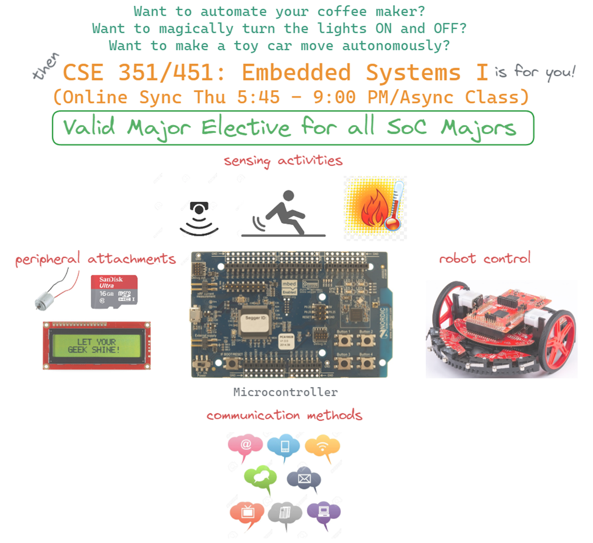
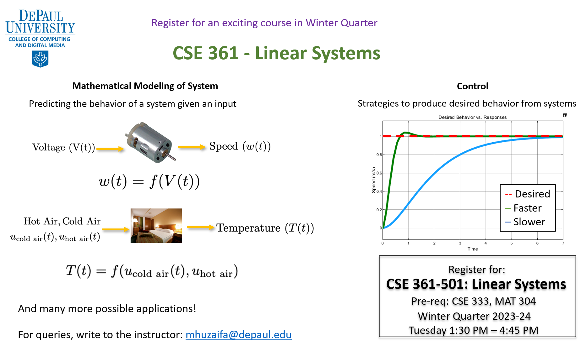

 ---
title: "Teaching"
date: 2022-03-19T00:00:14-05:00
draft: false
---

My teaching career has spanned over different roles in [DePaul University](https://depaul.edu), [Rose-Hulman Instritute of Technology (RHIT)](https://www.rose-hulman.edu/), [University of Illinois at Urbana-Champaign (UIUC)](https://illinois.edu), and [National University of Science and Technology, Pakistan (NUST)](https://nust.edu.pk).

The courses I have developed from scratch span both the fundamentals engineering and computer science, and advanced topics in control systems, robotics and embedded systems.

**Current Schedule:**
Fall 2023
- CSC 241 Introduction to Programming

**Future Schedule:**
Winter 2023-24

- CSE 351 Embedded Systems I

- CSE 361 Linear Systems

<!--
- [CSE 352 Embedded Systems II](https://d2l.depaul.edu/d2l/le/content/872504/Home)

- [CSE 362 Foundations of Cyber-Physical Computing](https://d2l.depaul.edu/d2l/le/content/872502/Home) -->

----------------

**Senior Undergraduate / Graduate Courses:**

| Course Title | Institute |
|:---|:---:|
| [CSC 375/475 - Introduction to Robotics](https://www.cdm.depaul.edu/academics/pages/classinfo.aspx?Term=20221&ClassNbr=18514&fid=1306303) | DePaul |
| [CSE 351/451 - Embedded Systems I](https://www.cdm.depaul.edu/academics/pages/courseinfo.aspx?CrseId=014846) | DePaul |
| [CSE 352 - Embedded Systems II](https://www.cdm.depaul.edu/academics/pages/classinfo.aspx?Term=20213&ClassNbr=30840&fid=300081) | DePaul |
| [CSE 361 - Linear Systems](https://www.cdm.depaul.edu/academics/pages/courseinfo.aspx?Subject=CSE&CatalogNbr=361)| DePaul |
| [CSE 362 - Foundations of Cyber-Physical Computing](https://www.cdm.depaul.edu/academics/pages/courseinfo.aspx?Subject=CSE&CatalogNbr=362) | DePaul |
| [ME 340 - Dynamics of Mechanical Systems](https://mechse.illinois.edu/graduate/graduate-course-offerings/ME340)| UIUC |
| EE 371 - Linear Control Systems Lab | NUST |

<!-- (https://drive.google.com/file/d/16irGFUnvk3v0GNcYaFwCDL1b-VdFAjCd/view?usp=sharing) -->

<!-- (https://drive.google.com/file/d/1iljKK3DDC053hZqZSROyzScpZCHkGFzu/view?usp=sharing)  -->

<!-- (https://drive.google.com/file/d/16iuti0OBdVFXyo58s7Rap6UX7cSm1d8B/view?usp=sharing)  -->
----------------

**Fundamental Courses:**

| Course Title | Institute |
|:---|:---:|
| [CSC 241 - Introduction to Computing](https://www.cdm.depaul.edu/academics/pages/courseinfo.aspx?CrseId=009142) | DePaul |
| [ECE 203 - Fundaments of Electric Circuits](https://www.rose-hulman.edu/academics/course-catalog/current/programs/Electrical%20Engineering/ece-203.html) | RHIT |
| [ECE 206 - Elements of Electrical Engineering](https://www.rose-hulman.edu/academics/course-catalog/2018-2019/programs/Electrical%20Engineering/ece-206.html) | RHIT |
| EE 221 - Digital Logic Design Lab | NUST |
| EE 222 - Microprocessor Systems Lab | NUST |
----------------
