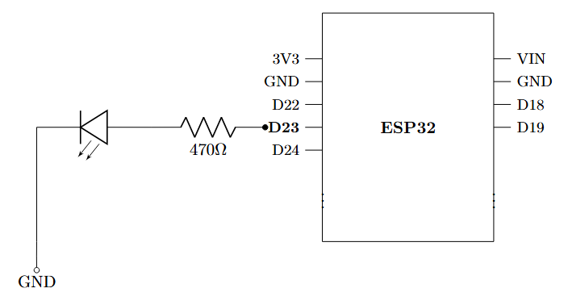

# Power Monitoring and Comparison of ESP32 and nRF52 Device

### **Goal:**

- learn about and use the power saving features in ESP32 adn nRF
- Demonstrate the features in an LED lighting and user data input application
- Compare the results of the two

### **Components Needed:**

- ESP32 (ready to go)
- nRF52832 (or another nRF device)
- LED with 470 ohm resistor (3.3/470 gives ~7 mA)
- An external USB Connector to measure the current ([DROK USB Tester](https://www.notion.so/Power-Monitoring-and-Comparison-of-ESP32-and-nRF52-Device-2c2ca269b2bb80dfbda4c2428080980f?pvs=21))

### **Software Needs:**

- PlatformIO environment for ESP32
- VS Code and Zephyr for nRF Device
- Hardware access in both for current measurement

### **ESP32 Circuit:**

## LED Operation

### Always ON

Ammeter Readings and circuit diagrams in action
Violet LED: 

Yellow LED:

Green LED:

Red LED:

$$
V_f = V_{in}-I\times 470
$$

| **LED Color** | **Applied Voltage (V)** | **Current Recorded (mA)** | **Forward Voltage (V)** |
| --- | --- | --- | --- |
| Violet | 3.3 | 0.67 | 2.98 |
| Yellow | 3.3 | 2.7 | 2.03 |
| Green | 3.3 | 2.61 | 2.07 |
| Red | 3.3 | 2.83 | 1.97 |

### Blinking Pattern (30 Hz)
Violet:

Yellow: (1.25 mA - 1.31 mA)

Green: (1.21 mA - 1.27 mA)

RED: (1.21 mA - 1.27 mA)

